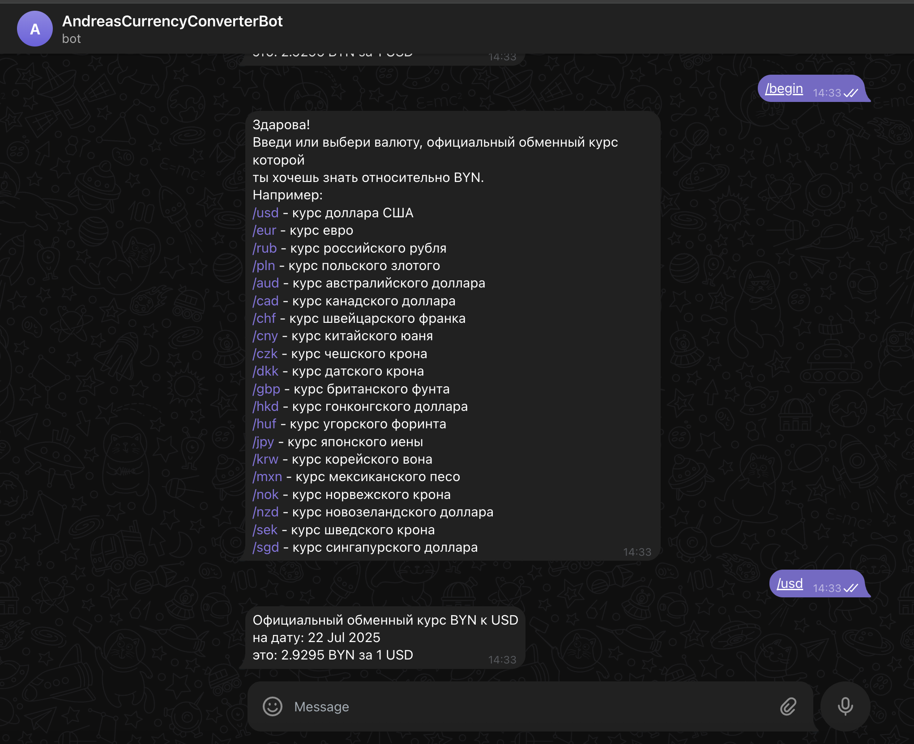

# $${\color{#ff0048}Currency \space \color{#00f0ec}Converter \space \color{Magenta}Bot \space \color{yellow}Project}$$

## Описание
:rocket: **Конвертация разных валют по отношению к BYN(Belarusian ruble)**.
 
:rocket: **Простой и интуитивно понятный интерфейс**.
 
:rocket: **Поддержка всех основных мировых валют**. 

## Использованные технологии
:white_check_mark:   Lombok
:white_check_mark:   Spring Boot
:white_check_mark:   Java 17
:white_check_mark:   Maven
:white_check_mark:   JUnit
:white_check_mark:   Telegram Bot API
 
:white_check_mark:   Получение данных из НБРБ(Национальный банк Республики Беларусь): https://www.nbrb.by/api/exrates/rates/

## Установка 
**1.Склонируйте репозиторий, напишите официальному боту в тг @BotFather для регистрации бота и получение токена**;
 
**2.В application.properties bot.token="интегрируйте ваш полученный токен" и запустите проект в Intellij Idea**;
 
**3.В тг найдите в поиске и интегрируйте бота @AndreasCurrencyConverterBot в свой канал или в переписку**; 
 
**4.Пропишите команду /begin для запуска бота**. 
 
:black_square_button: :black_square_button: :black_square_button:

